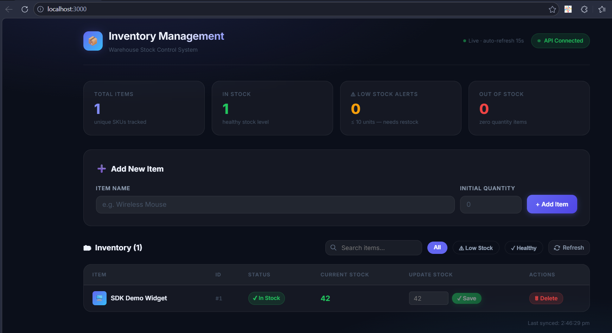
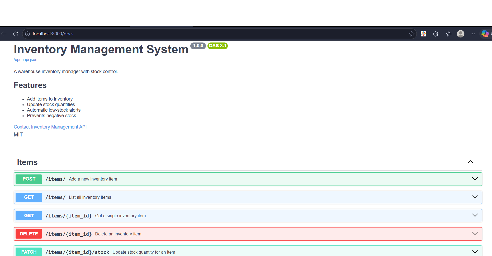
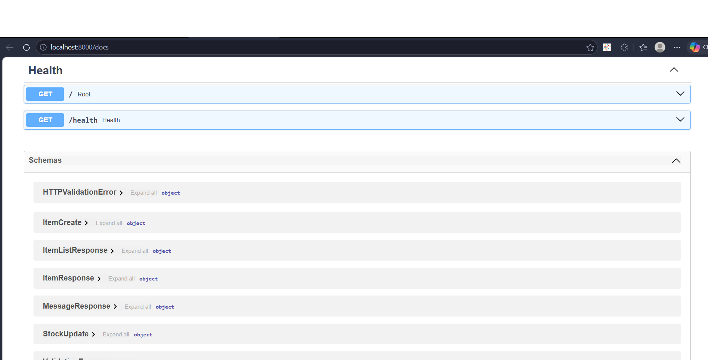
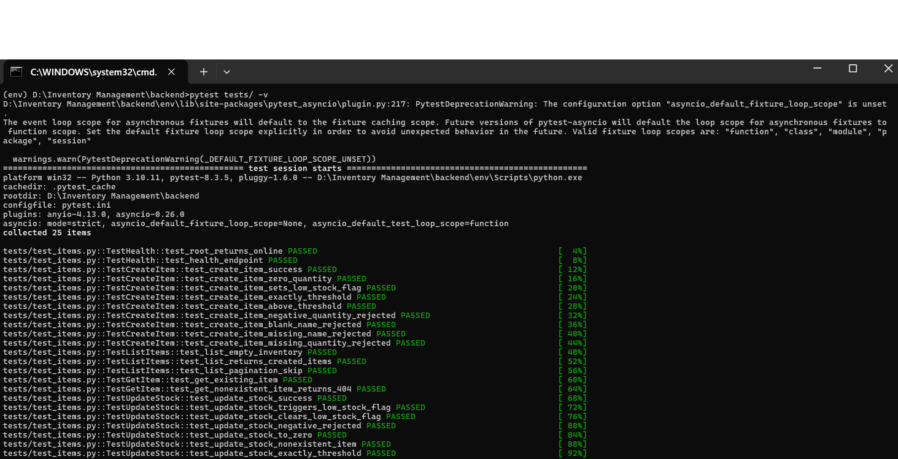

# Inventory Management System

> A full-stack warehouse inventory manager built with FastAPI, SQLite, ReactJS, and auto-generated Python SDK.

---

## Key Features
- Add / view / update inventory items
- Prevent negative stock
- Automatic low-stock alerts
- React dashboard
- OpenAPI-generated Python SDK
- Automated setup scripts

## Quick Start (Windows)

```bash
# Step 1: Clone / extract the project
cd "Inventory Management"

# Step 2: One-command setup (installs everything + runs tests)
setupdev.bat

# Step 3: Launch the full application
runapplication.bat
```
## Screenshots

### Frontend Dashboard


### Swagger Overview


### Swagger Endpoint Testing


### Unit Tests


| Service | URL |
|---------|-----|
| 🖥 React Frontend | http://localhost:3000 |
| ⚡ FastAPI Backend | http://localhost:8000 |
| 📖 Swagger UI | http://localhost:8000/docs |
| 📘 ReDoc | http://localhost:8000/redoc |
| 🔗 OpenAPI JSON | http://localhost:8000/openapi.json |

---

## 📁 Project Structure

```
Inventory Management/
├── backend/                    # FastAPI + SQLite backend
│   ├── main.py                 # Uvicorn entry point
│   ├── requirements.txt        # Python dependencies
│   ├── alembic.ini             # Alembic config
│   ├── pytest.ini              # Test config
│   ├── seed_data.sql           # Sample data (15 items)
│   ├── alembic/
│   │   ├── env.py              # Migration environment
│   │   └── versions/
│   │       └── 0001_initial_create_items_table.py
│   ├── app/
│   │   ├── __init__.py         # App factory (create_app)
│   │   ├── database.py         # SQLAlchemy engine + get_db()
│   │   ├── models.py           # Item ORM model
│   │   ├── schemas.py          # Pydantic v2 schemas
│   │   ├── crud.py             # Database operations
│   │   └── routers/
│   │       └── items.py        # All /items endpoints
│   └── tests/
│       └── test_items.py       # 20+ unit tests
│
├── frontend/                   # ReactJS frontend
│   ├── package.json
│   ├── public/index.html
│   └── src/
│       ├── index.js            # React entry point
│       ├── index.css           # Dark glassmorphism design system
│       ├── App.js              # Main app with real-time polling
│       ├── api.js              # Axios API client
│       └── components/
│           ├── AddItemForm.js  # Add item form
│           └── InventoryTable.js # Stock table with inline edit
│
├── setupdev.bat                # One-click dev environment setup
├── runapplication.bat          # Launch backend + frontend
├── generate_sdk.bat            # Generate Python SDK from OpenAPI
├── sdk_demo.py                 # SDK usage demonstration
├── .gitignore
└── README.md                   # This file
```

---

## 🏗 Architecture

```
┌─────────────────────────────────────────────────┐
│                  React Frontend                  │
│   (Port 3000 · Axios · Real-time polling 15s)   │
└──────────────────────┬──────────────────────────┘
                       │ HTTP/REST
                       ▼
┌─────────────────────────────────────────────────┐
│              FastAPI Backend (Port 8000)         │
│                                                 │
│  ┌─────────┐  ┌──────────┐  ┌───────────────┐  │
│  │ Routers │→ │   CRUD   │→ │  SQLAlchemy   │  │
│  │/items/* │  │  Layer   │  │     ORM       │  │
│  └─────────┘  └──────────┘  └──────┬────────┘  │
│                                    │            │
│                              ┌─────▼─────┐     │
│                              │  SQLite   │     │
│                              │inventory.db│    │
│                              └───────────┘     │
└─────────────────────────────────────────────────┘
                       │ openapi.json
                       ▼
┌─────────────────────────────────────────────────┐
│         OpenAPI Generator CLI (npm)              │
│         → Generates inventory_sdk/               │
└─────────────────────────────────────────────────┘
```

---

## 1️⃣ Backend (FastAPI + SQLite)

### API Endpoints

| Method | Endpoint | Description |
|--------|----------|-------------|
| `GET` | `/` | Health check |
| `GET` | `/health` | Detailed health |
| `POST` | `/items/` | ➕ Add new item |
| `GET` | `/items/` | 📋 List all items (paginated) |
| `GET` | `/items/{id}` | 🔍 Get single item |
| `PATCH` | `/items/{id}/stock` | 📦 Update stock quantity |
| `DELETE` | `/items/{id}` | 🗑 Delete item |

### ⚠️ Trick Logic — Business Rules

The stock update endpoint enforces two hidden rules:

| Rule | Behavior |
|------|----------|
| **No Negative Stock** | `quantity < 0` → `422 Unprocessable Entity` (Pydantic layer) + `400 Bad Request` (route layer, double protection) |
| **Low-Stock Alert** | When `quantity ≤ 10` → `low_stock = true` is automatically set |
| **Low-Stock Cleared** | When `quantity > 10` → `low_stock = false` is cleared |

```python
# Enforced in schemas.py (Pydantic validator)
@field_validator("quantity")
def quantity_must_not_be_negative(cls, v):
    if v < 0:
        raise ValueError("Stock cannot be negative.")
    return v

# Enforced in models.py (business logic)
def update_low_stock_flag(self):
    self.low_stock = self.quantity <= self.LOW_STOCK_THRESHOLD  # 10
```

### Database Schema

```sql
CREATE TABLE items (
    id         INTEGER PRIMARY KEY AUTOINCREMENT,
    name       TEXT    NOT NULL,
    quantity   INTEGER NOT NULL DEFAULT 0,
    low_stock  BOOLEAN NOT NULL DEFAULT 0,  -- auto-managed
    created_at DATETIME DEFAULT CURRENT_TIMESTAMP,
    updated_at DATETIME DEFAULT CURRENT_TIMESTAMP
);
```

Managed via **Alembic** migrations. The initial migration is in `alembic/versions/0001_initial_create_items_table.py`.

### Running Manually

```bash
cd backend
python -m venv env
call env\Scripts\activate        # Windows
pip install -r requirements.txt
alembic upgrade head
python main.py
```

---

## 2️⃣ Database (SQLite + Alembic)

```bash
# Apply migrations
alembic upgrade head

# Seed with sample data (requires sqlite3 CLI)
sqlite3 inventory.db < seed_data.sql

# Revert last migration
alembic downgrade -1
```

The `seed_data.sql` file populates 15 realistic items covering:
- Normal stock items
- Low-stock items (≤ 10 units)
- Out-of-stock items (0 units)

---

## 3️⃣ Frontend (ReactJS)

Built with **React 18** + **Axios**. No direct database access — all operations go through the API.

### Features
- 📊 **Live stats bar**: total SKUs, in-stock, low-stock alerts, out-of-stock count
- ➕ **Add item form**: validated client-side before API call
- 📋 **Inventory table**: sortable, with inline stock editor per row
- 🔍 **Search + Filter**: search by name, filter by stock status
- ♻️ **Real-time polling**: auto-refreshes every 15 seconds (bonus feature)
- 🔔 **Toast notifications**: success/warning/error feedback
- ⚠️ **Client-side trick logic guard**: negative stock blocked before API call too

### Running Manually

```bash
cd frontend
npm install
npm start
```

---

## 4️⃣ Python SDK (OpenAPI Generator)

The SDK is **not hand-written** — it is generated automatically from the live OpenAPI spec.

### Generate the SDK

```bash
# Ensure backend is running, then:
generate_sdk.bat

# Or manually:
npm install -g @openapitools/openapi-generator-cli
openapi-generator-cli generate \
  -i http://localhost:8000/openapi.json \
  -g python \
  -o inventory_sdk \
  --additional-properties=packageName=inventory_sdk
```

### Install & Use the SDK

```bash
cd inventory_sdk
pip install -e .
```

```python
from inventory_sdk.api.items_api import ItemsApi
from inventory_sdk.api_client import ApiClient
from inventory_sdk.configuration import Configuration
from inventory_sdk.models.item_create import ItemCreate
from inventory_sdk.models.stock_update import StockUpdate

# Configure client
config = Configuration(host="http://localhost:8000")
client = ApiClient(configuration=config)
api = ItemsApi(api_client=client)

# List all items
result = api.list_items_items_get()
print(result)

# Add a new item
new_item = api.add_item_items_post(
    item_create=ItemCreate(name="Widget A", quantity=50)
)

# Update stock
updated = api.update_stock_items__item_id__stock_patch(
    item_id=new_item.id,
    stock_update=StockUpdate(quantity=5),
)

# ⚠️ Trick Logic: negative quantity will raise an exception
api.update_stock_items__item_id__stock_patch(
    item_id=new_item.id,
    stock_update=StockUpdate(quantity=-1),  # → raises ApiException (422)
)
```

Run the full demo:
```bash
python sdk_demo.py
```

---

## ✅ Unit Tests

```bash
cd backend
call env\Scripts\activate
pytest tests/ -v
```

**20+ test cases** covering:

| Category | Tests |
|----------|-------|
| Health endpoints | `test_root_returns_online`, `test_health_endpoint` |
| Create item | Valid creation, zero qty, low-stock flag, threshold boundary, **negative qty rejected**, blank name rejected |
| List items | Empty state, correct counts, pagination |
| Get item | Found, 404 not found |
| Update stock | Success, **low-stock flag triggered**, flag cleared, **negative rejected**, zero, 404, exact threshold |
| Delete item | Success, 404 |

---

## 5️⃣ Automation Scripts

| Script | Purpose |
|--------|---------|
| `setupdev.bat` | Creates venv, installs deps, runs migrations, seeds DB, runs tests |
| `runapplication.bat` | Starts backend + frontend in separate windows, opens browser |
| `generate_sdk.bat` | Installs openapi-generator-cli, generates Python SDK |

---

## 🔧 Requirements

| Tool | Version |
|------|---------|
| Python | 3.11+ |
| Node.js | 18+ |
| npm | 9+ |
| Java (for SDK gen) | 11+ *(required by openapi-generator-cli)* |

> ⚠️ **Docker is NOT used** as per the challenge requirements.

---

## 📋 Evaluation Criteria Checklist

| Criterion | Status |
|-----------|--------|
| ✅ Code Quality — well-structured, modular | Implemented |
| ✅ Correct API Implementation — follows OpenAPI standards | Implemented |
| ✅ Proper Error Handling — 4xx/5xx with detail messages | Implemented |
| ✅ Platform SDK — generated via OpenAPI Generator CLI | Implemented |
| ✅ Frontend Integration — React via Axios only (no direct DB) | Implemented |
| ✅ Automation Scripts — `setupdev.bat` + `runapplication.bat` | Implemented |
| ✅ Unit Tests — 20+ covering all endpoints + trick logic | Implemented |
| ✅ Backend Trick Logic — negative stock rejected + low-stock alerts | Implemented |
| ✅ Documentation — this README | Implemented |
| 🌟 Bonus: Real-time updates (15s polling) | Verified |

## Future Improvements
- Authentication / RBAC
- CSV import/export
- WebSocket live updates
- Email low-stock alerts
- Audit logs

---


